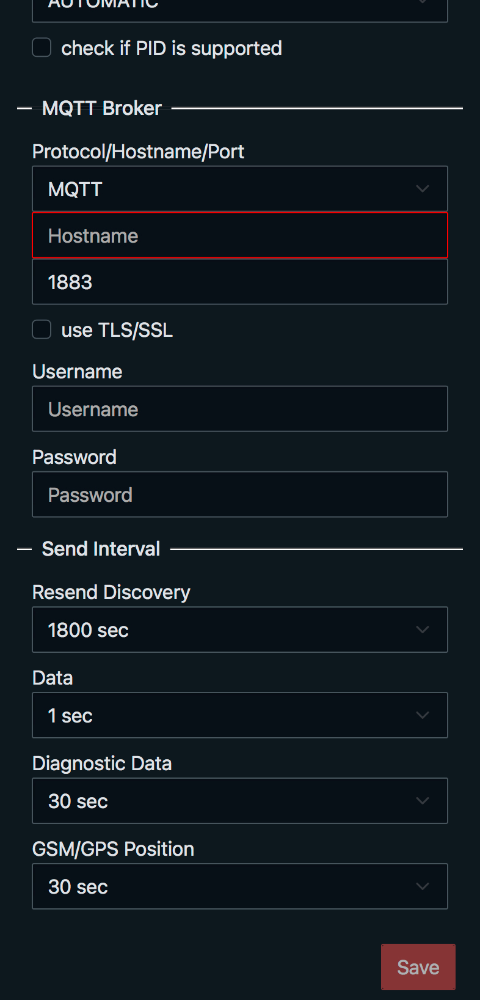

# OBD2 to MQTT for Home Assistant

## What you need?

* an installed Home Assistant with Mosquitto Broker
* (optional) an installed PlatformIO
* (optional) an installed NodeJS and NPM
* a ESP32 with [SIM800L](https://de.aliexpress.com/item/33045221960.html)
  or [A7670](https://de.aliexpress.com/item/1005006477044118.html)
    * (optional) [RP-SMA to IPX cable](https://www.amazon.de/dp/B0B9RXDLNN)
    * (optional) [Antenna](https://www.amazon.de/dp/B0B2DCXL5N) (work's for me) or other
    * (optional) a 3D Printer for the [case](3d-files)
* a [ELM327 OBD Bluetooth Adapter](https://de.aliexpress.com/item/1005005775562398.html) or any other
* a SIM Card - i use one
  from [fraenk](https://fraenk.page.link/?link=https%3A%2F%2Ffraenk.de%2Fdeeplink%2Fmgm%3FfriendCode%3DRENA45&apn=de.congstar.fraenk&amv=1040000&imv=1.4&isi=1493980266&ibi=de.congstar.fraenk&ius=fraenk&ofl=https%3A%2F%2Ffraenk.de)
* and the most important thing, a car

## Getting started

### Upload via Web Installer (ESP Web Tools)

If you don't want to install PlatformIO and compile by your own, use
the [Web Installer](https://adlerre.github.io/obd2-mqtt/).

### Update Settings or Firmware & Filesystem

* connect to WiFi Access Point starts with name OBD2-MQTT- followed from device MAC
* open Browser and navigate to http://192.168.4.1
* change settings to your needs and reboot afterward __OR__ update to new firmware and filesystem

<p>




</p>

### Build

Build firmware.bin

```bash
pio run [-e OPTIONAL ENV]
```

Build littlefs.bin

```bash
pio run --target buildfs [-e OPTIONAL ENV]
```

### Upload

Build and upload firmware.bin to device

```bash
pio run --target upload -e T-Call-A7670X-V1-0
```

Build and upload littlefs.bin to device

```bash
# connect to AP and save current settings
curl http://192.168.4.1/api/settings -o settings.json

pio run --target uploadfs -e T-Call-A7670X-V1-0

# after reboot connect to AP
curl -X PUT -H "Content-Type: application/json" -d @settings.json http://192.168.4.1/api/settings
```

## Configure Sensors

With shipped default profile following Sensors are included:

* Ambient Temperature
* Battery Voltage
* Calculated average speed
* Calculated consumption
* Calculated consumption per 100km
* Calculated driven distance
* Check Engine Light
* Engine Coolant Temperature
* Engine Load
* Engine Running
* Fuel Level
* Fuel Rate
* Intake Air Temperature
* Kilometer per Hour
* Mass Air Flow
* Odometer
* Oil Temperature
* Pedal Position
* Rounds per minute
* Throttle
* Top Speed ;-)

Diagnostic Output on all profiles:

* CPU Temperature (ESP)
* Free Memory (ESP)
* GPS Location (only for A76xx)
* GSM Location
* Signal Quality
* Uptime

<p>


</p>

### Custom OBD States

On the OBD tab you can adjust the required states and upload and/or download the current profile.
There two types of states, __READ__ and __CALC__, both can be a value type of __BOOL__, __FLOAT__ or __INT__.


#### READ
The READ state is used to read PIDs, either using an internal function or by setting the PID codes, response, and value changes.<br />
Option __scale factor__ can be a mathematical expression.<br />
The PID codes must be entered in decimal __NOT__ hexadecimal.

##### Example

with internal function:

```json
{
    "type": 0,
    "valueType": "float",
    "enabled": true,
    "visible": true,
    "interval": 30000,
    "name": "batteryVoltage",
    "description": "Battery Voltage",
    "icon": "battery",
    "unit": "V",
    "deviceClass": "voltage",
    "measurement": true,
    "diagnostic": false,
    "expr": null,
    "readFunc": "batteryVoltage"
}
```

or with PID codes and value changes:

```json
{
    "type": 0,
    "valueType": "int",
    "enabled": true,
    "visible": true,
    "interval": 100,
    "name": "rpm",
    "description": "Rounds per minute",
    "icon": "engine",
    "measurement": true,
    "diagnostic": false,
    "pid": {
      "service": 1,
      "pid": 12,
      "numResponses": 1,
      "numExpectedBytes": 2,
      "scaleFactor": "1.0 / 4.0",
      "bias": 0
    }
}
```

#### CALC
The CALC state can be used to calculate a value based on other states.

##### Example

```json
{
    "type": 1,
    "valueType": "float",
    "enabled": true,
    "visible": true,
    "interval": 100,
    "name": "distanceDriven",
    "description": "Calculated driven distance",
    "icon": "map-marker-distance",
    "unit": "mi",
    "deviceClass": "distance",
    "measurement": true,
    "diagnostic": false,
    "expr": "$distanceDriven + ($speed.ov + $speed) / 2 / 3600 * ($millis - $distanceDriven.lu) / 1000",
    "pid": {
      "service": 0,
      "pid": 0,
      "numResponses": 0,
      "numExpectedBytes": 0,
      "bias": 0
    },
    "value": {
      "func": "toMiles"
    }
}
```

##### Expression

Within an expression, other states can be used to calculate the value. To do this use the state name with a leading $.
It is also possible to use previous values and stored timestamps for this purpose.

* **$millis**<br />
  *predefined*

  the current timestamp

* **$speed**<br />
  
  the current value

* **$speed.ov**<br />

  the previous value

* **$speed.pu**<br />

  the previous updated timestamp

* **$speed.lu**<br />

  the last updated timestamp

There are also some internal mathematical functions like:

single parameter functions:

* sin, cos, tan
* asin, acos, atan
* sinh, cosh, tanh
* asinh, acosh, atanh
* ln, log, exp
* sqrt, sqr
* round, int

two parameter functions:

* min, max

as well as internal functions:

* afRatio - air flow ratio by fuel type
* density - density by fuel type
* numDTCs - number of DTCs, is required to call monitor status first. see [default profile](profiles/states-imperial.json)

##### Value Format

Can be used with simple __printf__ compatible expression, such as %d for __int__ or %.2f for __float__ output. If you leave this field blank, the default values are used.<br />
Or you can use the format expression to perform some calculations. Within this expression, only $value (for the current value) is allowed.
There are also some built-in functions for formatting values.

* **toBitStr**<br />

  Format as Bit String

* **toMiles**<br />

  Convert km to mi

* **toGallons**<br />

  Convert L to gal

* **toMPG**<br />

  Convert L/100km to MPG

## If you are afraid of the Internet...

...and don't want to expose your MQTT broker on the Internet, use a free MQTT provider and take a look
on [mqtt-proxy](tools/mqtt-proxy) tool.
