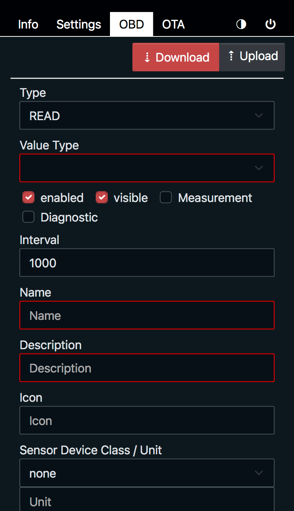
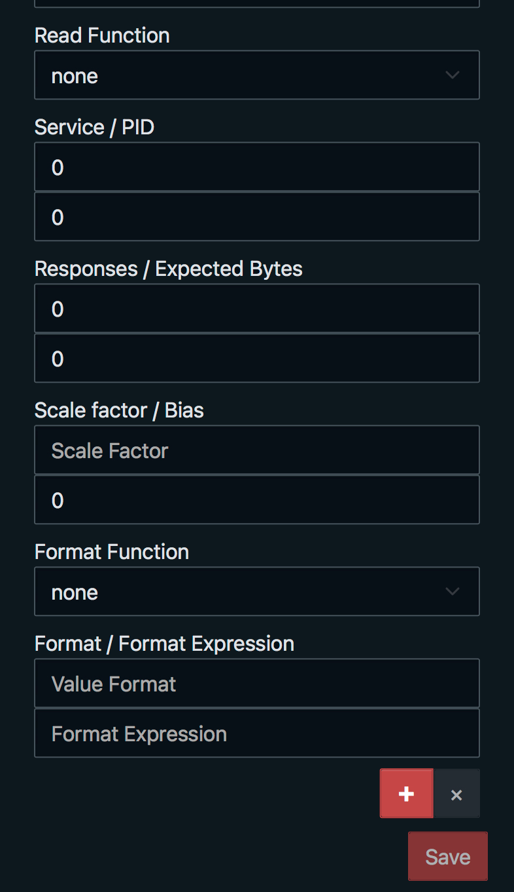

# OBD2 to MQTT for Home Assistant

## What you need?

* an installed Home Assistant with Mosquitto Broker
* (optional) an installed PlatformIO
* (optional) an installed Node.js and NPM
* a ESP32 with [SIM800L](https://de.aliexpress.com/item/33045221960.html)
  or [A7670](https://de.aliexpress.com/item/1005006477044118.html)
    * (optional) [RP-SMA to IPX cable](https://www.amazon.de/dp/B0B9RXDLNN)
    * (optional) [Antenna](https://www.amazon.de/dp/B0B2DCXL5N) (work's for me) or other
    * (optional) a 3D Printer for the [case](3d-files)
* a [ELM327 OBD Bluetooth Adapter](https://www.amazon.de/gp/product/B0BG4W6MLD) or any other
    * if you want to use [this](https://de.aliexpress.com/item/1005005775562398.html) cheap adapter, you should set the
      right connection protocol or have patience
* a SIM Card - I use one
  from [fraenk](https://fraenk.page.link/?link=https%3A%2F%2Ffraenk.de%2Fdeeplink%2Fmgm%3FfriendCode%3DRENA45&apn=de.congstar.fraenk&amv=1040000&imv=1.4&isi=1493980266&ibi=de.congstar.fraenk&ius=fraenk&ofl=https%3A%2F%2Ffraenk.de)
* and the most important thing, a car

## Supported Devices

| Product                                                                         | Environment                                                          | SSL/TLS                       | Case                                                                                                                                                                                                                    |
|---------------------------------------------------------------------------------|----------------------------------------------------------------------|-------------------------------|-------------------------------------------------------------------------------------------------------------------------------------------------------------------------------------------------------------------------|
| [T-Call SIM800L](https://lilygo.cc/products/t-call-v1-4?variant=42868250869941) | SIM800L_IP5306_VERSION_20190610 <br/>SIM800L_IP5306_VERSION_20200811 | ❌ (only SSL 2/3, TLS 1.0/1.2) | [Case](3d-files/README.md#for-sim800l-boards)                                                                                                                                                                           |
| T-Call SIM800C                                                                  | SIM800L_AXP192_VERSION_20200327<br/>SIM800C_AXP192_VERSION_20200609  | ❌ (only SSL 2/3, TLS 1.0/1.2) | [Case](3d-files/README.md#for-sim800l-boards)                                                                                                                                                                           |
| [T-Call A7670](https://lilygo.cc/products/t-call-v1-4?variant=43440642719925)   | T-Call-A7670X-V1-0<br/>T-Call-A7670X-V1-1                            | ✅                             | [Case with internal GPS/LTE](3d-files/README.md#for-a7670-boards-with-included-gps-antenna)<br/>[Case with external GPS/LTE](3d-files/README.md#for-a7670-boards-with-external-gps4g-antenna)                           |
| [T-A7670E/G/SA R2](https://lilygo.cc/products/t-sim-a7670e)                     | T-A7670X                                                             | ✅                             | [Case with internal GPS/LTE](3d-files/README.md#for-a7670-boards-with-battery-and-internal-gps4g-antenna)<br/>[Case with external GPS/LTE](3d-files/README.md#for-a7670-boards-with-battery-and-external-gps4g-antenna) |
| [T-A7670E/G/SA R2 without GPS](https://lilygo.cc/products/t-sim-a7670e)         | T-A7670X-NO-GPS                                                      | ✅                             | [Case](3d-files/README.md#for-a7670-boards-with-battery-and-internal-gps4g-antenna)                                                                                                                                     |
| [T-A7670G with GPS Shield](https://lilygo.cc/products/t-sim-a7670e)             | T-A7670X-GPS-SHIELD                                                  | ✅                             | [Case with internal GPS/LTE](3d-files/README.md#for-a7670-boards-with-battery-and-internal-gps4g-antenna)<br/>[Case with external GPS/LTE](3d-files/README.md#for-a7670-boards-with-battery-and-external-gps4g-antenna) |
| [Waveshare ESP32 S3 A7670E](https://www.waveshare.com/esp32-s3-a7670e-4g.htm)   | WS-A7670E_BLE (BLE only)                                             | ✅                             |                                                                                                                                                                                                                         |

## Getting started

### Upload via Web Installer (ESP Web Tools)

If you don't want to install PlatformIO and compile by your own, use
the [Web Installer](https://adlerre.github.io/obd2-mqtt/).

### Update Settings or Firmware & Filesystem

* connect to Wi-Fi Access Point starts with name OBD2-MQTT- followed from device MAC
* open Browser and navigate to http://192.168.4.1
* change settings to your needs and reboot afterward __OR__ update to new firmware and filesystem

<p>


</p>

### Build

Build firmware.bin

```bash
pio run [-e OPTIONAL ENV]
```

Build littlefs.bin

```bash
pio run --target buildfs [-e OPTIONAL ENV]
```

### Upload

Build and upload firmware.bin to device

```bash
pio run --target upload -e T-Call-A7670X-V1-0
```

Build and upload littlefs.bin to device

```bash
# connect to AP and save current settings
curl http://192.168.4.1/api/settings -o settings.json

pio run --target uploadfs -e T-Call-A7670X-V1-0

# after reboot connect to AP
curl -X PUT -H "Content-Type: application/json" -d @settings.json http://192.168.4.1/api/settings
```

## Settings

Configure Wi-Fi, Mobile settings according to your needs. Set the detected ELM327 device and optionally select the
protocol for faster initialization.<br />
Set up the MQTT configuration with your data. __If you want to use TLS/SSL on a SIM800 device, you need to know that
only SSL 2/3 and TLS 1.0 are supported.__
For devices with a battery, you can set the automatic sleep timeout (no data/ignition off) and the sleep duration.

## Configure Sensors

The following sensors are included in the supplied standard profile:

* Ambient Temperature
* Battery Voltage
* Calculated average speed
* Calculated consumption
* Calculated consumption per 100km
* Calculated driven distance
* Check Engine Light
* Engine Coolant Temperature
* Engine Load
* Engine Running
* Fuel Level
* Fuel Rate
* Intake Air Temperature
* Kilometer per Hour
* Mass Air Flow
* Odometer
* Oil Temperature
* Pedal Position
* Revolutions per minute
* Throttle
* Top Speed ;-)

Diagnostic Output on all profiles:

* CPU Temperature (ESP)
* Free Memory (ESP)
* GPS Location (only for A76xx)
* GSM Location
* Signal Quality
* Uptime

<p>


</p>

More profiles can be found [here](profiles).

### Custom OBD States

On the OBD tab you can adjust the required states and upload and/or download the current profile.
There two types of states, __READ__ and __CALC__, both can be a value type of __BOOL__, __FLOAT__ or __INT__.

<p>


</p>

Options:

* **enabled**

  the state is enabled

* **visible**

  the state is visible

* **Measurement**

  if the state is a measurement

* **Diagnostic**

  the state should be displayed as a diagnostic field

* **Interval**

  the update interval or -1 for onetime update

* **Name**

  the state name, only letters, numbers and underscore are allowed

* **Description**

  the state description, is shown in Home Assistant as field description

* **Icon**

  the state icon name without leading __mdi:__

* **Sensor Device Class**

  the sensor device class, [see](https://developers.home-assistant.io/docs/core/entity/sensor/)

* **Unit**

  the unit for device class or custom one

#### READ

The READ state is used to read PIDs, either using an internal function or by setting the PID codes, response, and value
changes. The PID codes must be entered in decimal __NOT__ hexadecimal.<br />
Option __scale factor__ can be a mathematical expression.<br />

##### Example

with internal function:

```json
{
  "type": 0,
  "valueType": "float",
  "enabled": true,
  "visible": true,
  "interval": 30000,
  "name": "batteryVoltage",
  "description": "Battery Voltage",
  "icon": "battery",
  "unit": "V",
  "deviceClass": "voltage",
  "measurement": true,
  "diagnostic": false,
  "readFunc": "batteryVoltage"
}
```

or with PID codes and value changes:

```json
{
  "type": 0,
  "valueType": "int",
  "enabled": true,
  "visible": true,
  "interval": 100,
  "name": "rpm",
  "description": "Revolutions per minute",
  "icon": "engine",
  "measurement": true,
  "diagnostic": false,
  "pid": {
    "service": 1,
    "pid": 12,
    "numResponses": 1,
    "numExpectedBytes": 2,
    "scaleFactor": "1.0 / 4.0",
    "bias": 0
  }
}
```

#### CALC

The CALC state can be used to calculate a value based on other states.

##### Example

```json
{
  "type": 1,
  "valueType": "float",
  "enabled": true,
  "visible": true,
  "interval": 100,
  "name": "distanceDriven",
  "description": "Calculated driven distance",
  "icon": "map-marker-distance",
  "unit": "mi",
  "deviceClass": "distance",
  "measurement": true,
  "diagnostic": false,
  "expr": "$distanceDriven + ($speed.ov + $speed) / 2 / 3600 * ($millis - $distanceDriven.lu) / 1000",
  "value": {
    "func": "toMiles"
  }
}
```

##### Expression

Within an expression, all mathematical operators are allowed as well as binary operator __&__ (and) and __|__ (or),
other states can be used to calculate the value. To do this use the state name with a leading __$__.<br />
It is also possible to use previous values and stored timestamps for this purpose.

Variables and it's substates:

* **$millis**<br />
  *predefined*

  the current timestamp

* **$var**<br />

  the current value

* **$var.ov**<br />

  the previous value

* **$var.pu**<br />

  the previous updated timestamp

* **$var.lu**<br />

  the last updated timestamp

* **$var.a**<br />
  *only for INT states*

  the first byte

* **$var.b**<br />
  *only for INT states*

  the second byte

* **$var.c**<br />
  *only for INT states*

  the third byte

* **$var.d**<br />
  *only for INT states*

  the fourth byte

There are also some internal mathematical functions like:

single parameter functions:

* sin, cos, tan
* asin, acos, atan
* sinh, cosh, tanh
* asinh, acosh, atanh
* ln, log, exp
* sqrt, sqr
* round, int

two parameter functions:

* min, max

as well as internal functions:

* __afRatio__ - air flow ratio by fuel type
* __density__ - density by fuel type
* __numDTCs__ - number of DTCs, is required to call monitor status first.
  see [default profile](profiles/states-imperial.json)

##### Value Format

Can be used with simple __printf__ compatible expression, such as %d for __int__ or %.2f for __float__ output. If you
leave this field blank, the default values are used.<br />
Or you can use the format expression to perform some calculations. Within this expression, only $value (for the current
value) is allowed.
There are also some built-in functions for formatting values.

* **toBitStr**<br />

  Format as Bit String

* **toMiles**<br />

  Convert km to mi

* **toGallons**<br />

  Convert L to gal

* **toMPG**<br />

  Convert L/100km to MPG
